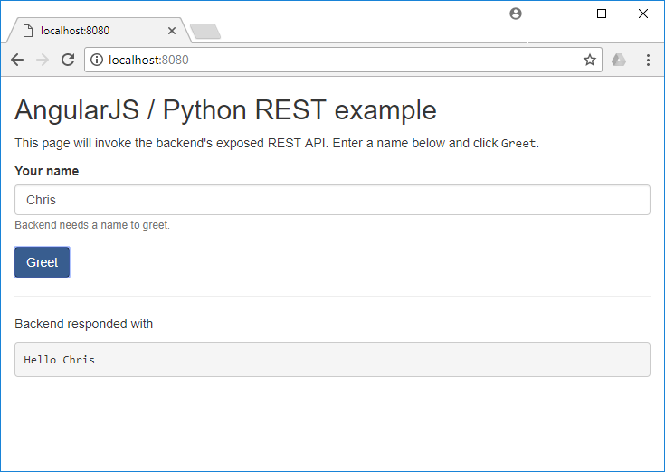

## py-rest-angularjs

**py-rest-angularjs** contains blueprint code for projects getting started with AngularJS and Python backends such as [flask](http://flask.pocoo.org/) or [aiohttp](http://aiohttp.readthedocs.io/en/stable/).

The web application consists of a static file serving part (to deliver AngularJS content) and a simple REST API to handle function calls from the AngularJS frontend. 



### Backend running `flask`

To run the flask based app make sure to have `flask` installed

```
pip install flask
```

Then from the directory containing this `Readme.md` run

```
python app_flask.py
```

and point your browser to the URL mentioned on the command line interface.

### Backend running `aiohttp`

aiohttp is based on Python's [asyncio](https://docs.python.org/3/library/asyncio.html) library for concurrent code. The syntax in the example uses keywords (`async`, `await`) which were introduced in Python 3.5 and later.

To run the aiohttp based app make sure to have `aiohttp` installed

```
pip install aiohttp
```

Then from the directory containing this `Readme.md` run

```
python app_aiohttp.py
```

and point your browser to the URL mentioned on the command line interface.